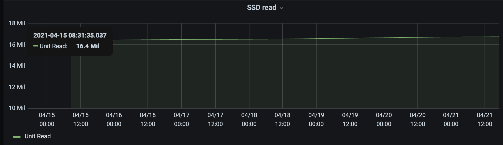

[](https://github.com/laurentbh/mac-stats/actions)

# mac-stats

Fetches battery and SSD info and stores in a Postgres DB.

Tested under Catalina (10.15.7)

## install
- build `go` binary
- create the database, [see schema](https://github.com/laurentbh/mac-stats/blob/main/schema.sql)
- config database, the config file needs to be either in the current dir or in ~/.config

 change the [config file](https://github.com/laurentbh/mac-stats/blob/main/mac-stats.yaml)

## display example

With [grafana](https://grafana.com/) and query

```
SELECT
  stamp AS "time",
  ((metrics->>'UnitRead')::integer) AS "Unit Read"
FROM
  ssd
WHERE
  $__timeFilter(stamp)

```

## scheduling
- update plist file
- start the job `launchctl load mac-stats.plist`

```bigquery
<?xml version="1.0" encoding="UTF-8"?>
<!DOCTYPE plist PUBLIC "-//Apple//DTD PLIST 1.0//EN" "http://www.apple.com/DTDs/PropertyList-1.0.dtd">
<plist version="1.0">
<dict>
  <key>Label</key>
  <string>laurent.mac-stats</string>

  <key>ProgramArguments</key>
  <array>
    <string>/Users/laurent/go/bin/mac-stats</string>
  </array>

  <key>StartInterval</key>
  <integer>3600</integer>

  <key>RunAtLoad</key>
  <true/>

  <key>StandardErrorPath</key>
  <string>/tmp/mac-stats.err</string>

  <key>StandardOutPath</key>
  <string>/tmp/mac-stats.out</string>
</dict>
</plist>

```
## requirements:
- [Postgres DB](https://www.postgresql.org/)
- [smartcl](http://www.smartmontools.org)
